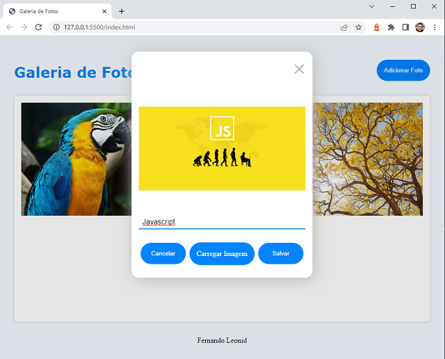

# Exemplo de uso firebase storage

Projeto com fins didáticos, demostrando a utilização do firebase como storage e enviando o link para o server API.

# Recursos (features) utilizados
* Layout flexivel utilizando o **CSS GRID**
* Formatar um **input** do tipo file
* **Preview** de uma imagem
* **Upload** de imagem para o firebase storage
* Enviar endereço da imagem para o **server API**

# Autores
 
[Fernando Leonid](https://github.com/fernandoleonid)

